# Android-Carputer project

## Carputer project

## Goals of POC
1. **PRIMARY GOAL** -> Display streaming video from RaspberryPI running motioneye.
2. **SECONDARY GOAL** -> Display of OBD-II/CANBUS data.  RaspberryPI will connect to OBD-II/CANBUS.
3. **STRETCH GOAL** -> Play music.
4. **STRETCH GOAL** -> Location services.  Maps.
5. **STRETCH GOAL** -> Sync data.  Upload data to cloud.

### Related Repositories
    <https://github.com/billdoerr/Hardware-Carputer>  
    <https://github.com/billdoerr/Python-Carputer>  
    <https://github.com/billdoerr/Android-Carputer> 

### Features
    - Will be based on a RaspberryPi 3 Model B running motionEye. 
    - Android tablet will be used for the user interface.**   
    - Primary goal is to have a front and rear car cameras.  RaspberryPi will archive video to USBStick and Android table will host the UI and have the ability to capture image snapshots. 

### Planned Features    
    - Display of OBD-II/CANBUS data.  RaspberryPI will connect to OBD-II/CANBUS.
    - Play music.
    - Location services.  Maps.
    - Sync data.  Upload data to cloud.

### Known Issues
    - Camera - mjpeg streaming video lags and choppy.

___
### HowTo
___
**Android-Carputer** 
Display streaming video from RaspberryPI running motionEye. 

**Navigation** 
App navigation is performed via the bottom navigation toolbar. 
 

And the drawer navigation which pulls out from the left. 
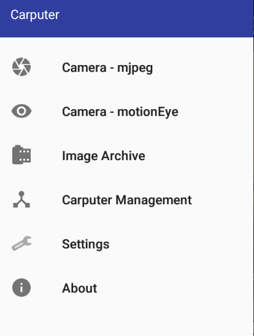 

**Camera - motionEye** 
The home screen defaults to the **Camera - motionEye** view which streams the configured cameras.   
There is one tab per configured motionEye node (not configured camera). 
The options menu **Snapshot** captures a screen shot of current video frame. 
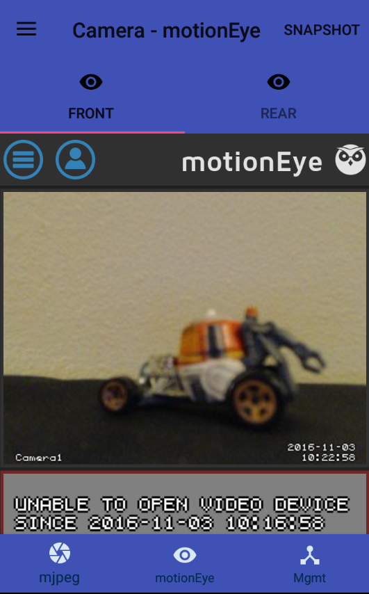

**Camera - mjpeg** 
The **Camera - mjpeg** view streams video in mjpeg format. This view is not ideal as the streamed video is choppy. 
There is one tab per configured camera. 
The options menu **Snapshot** captures a screen shot of current video frame. 
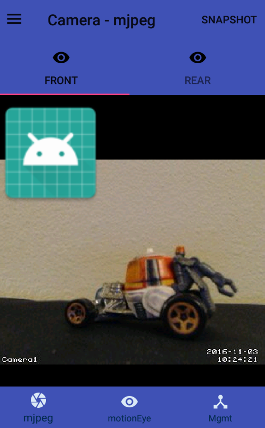

**Computer Management**  
The **Computer Management** view provides information of the connected nodes.  
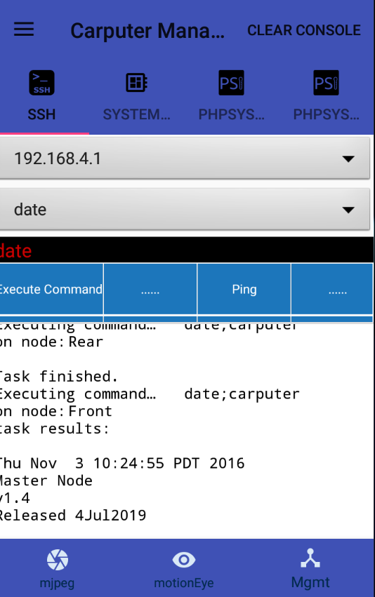 
This view contains tabs for: 
&nbsp;&nbsp;**SSH** - Provides simple commands and their output. 
&nbsp;&nbsp;**System Log** - View the system log. Contains options menu for **refresh** and **clear log**. 
&nbsp;&nbsp;**phpSysInfo** - Displays information about system facts like Uptime, CPU, Memory, PCI devices, SCSI devices, IDE devices, Network adapters, Disk usage, and more. 
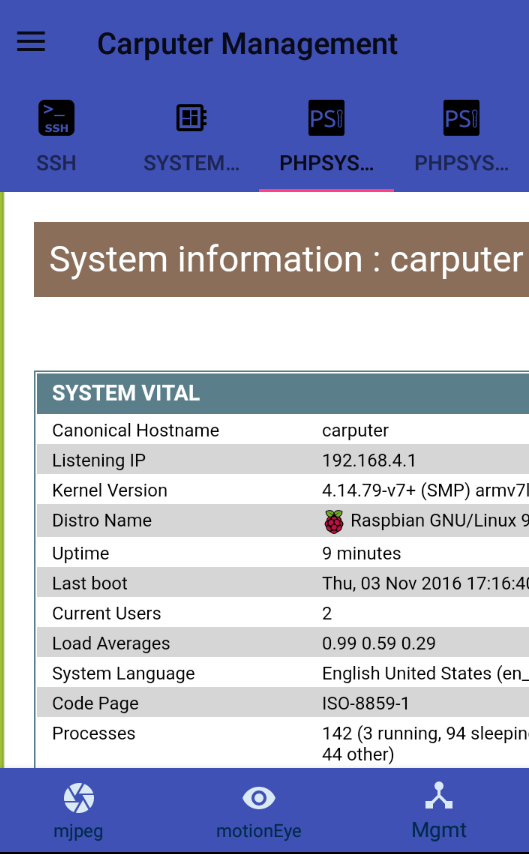 

**Image Archive** 
This contains two tabs: 
&nbsp;&nbsp;**Snapshots** - Contains list of images saved using **Snapshot**. To delete an image click on the image to delete. 
&nbsp;&nbsp;**Image Archive** - If RaspberryPi has attached storage. motionEye is configured to archive the streamed video. This view gives access to that archive storage. 
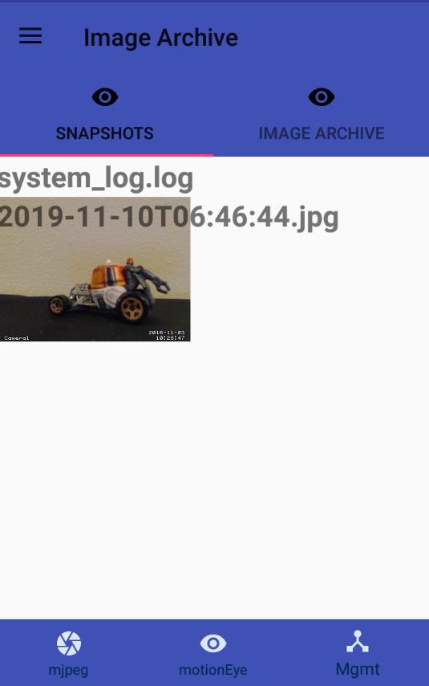&nbsp;&nbsp;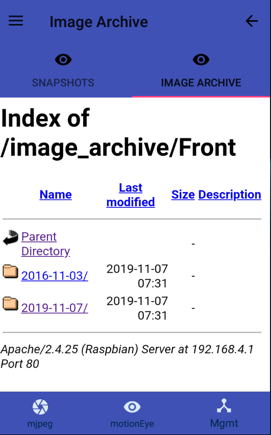 

**Settings** 
The settings screen allows to configure the following:. 
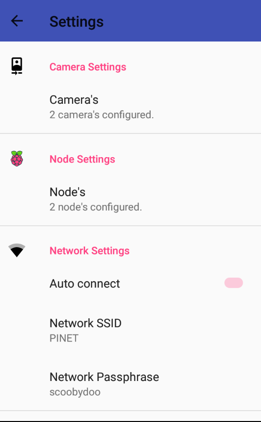

**Camera Details** 
Configure and add camera details. 
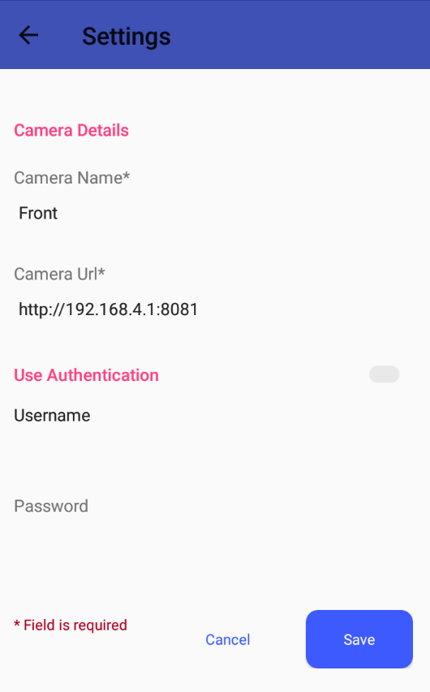 

**Node Details** 
Configure and add node details. 
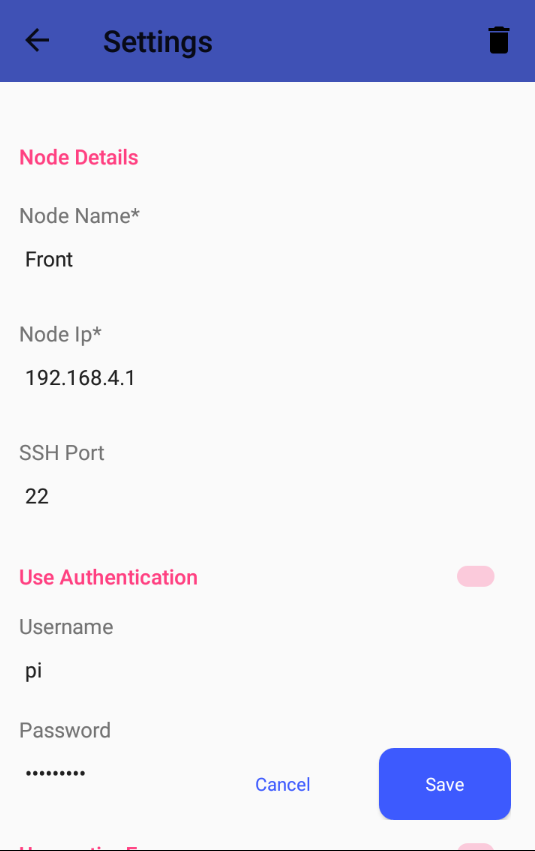 

**Network Settings** 
Configure the network settings. 

**Keep Device Awake** - Enabled by default. As long as this window is visible to the user, keep the device's screen turned on and bright. 

**Enable bottom navigation** - Always the bottom toolbar to be displayed or not. 

**Image Archive URL** - URL of the motionEye video archive storage. 

**About** 
Simple screen that shows the app name, version and build number. The build number is a date/time stamp when app was complied.  
An example build number is 1910300646: 19=year 10=month 03=day of month 06=hour 46=minutes 
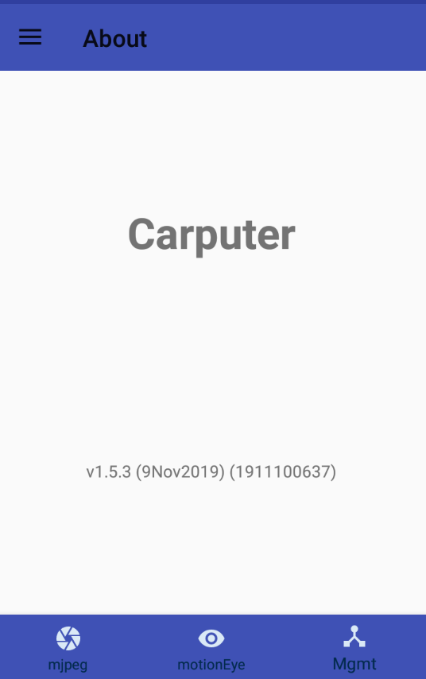

